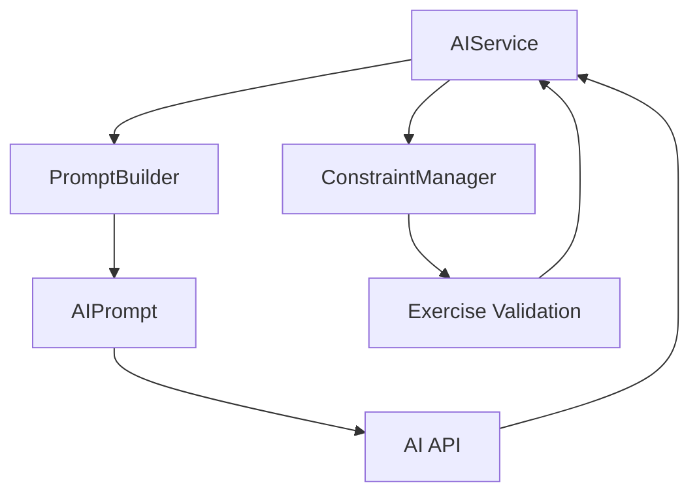

# **Service Layer Design and Implementation Guide**

The **Service Layer** in the Athlete Dashboard project acts as a centralized data aggregator and orchestrator. It is responsible for collecting, processing, and sending data across different feature components to ensure a clean separation of concerns and maintain scalability. This document outlines the updated description, best practices, and testing guidelines for building and maintaining the service layer.

---

## **1. Purpose of the Service Layer**

### **Key Responsibilities**

1. **Data Aggregation**  
   - Collect and merge data from various feature-specific services (e.g., Profile, Training Persona, Environment).  
   - Ensure the AI Workout Generator has access to complete and consistent user data.

2. **Business Logic**  
   - Centralize domain-specific logic, such as data transformations or default value handling.  
   - Prevent business logic from being scattered across endpoints or feature components.

3. **Decoupling**  
   - Provide a clean interface for endpoints, allowing them to focus solely on request/response handling.  
   - Keep frontend components agnostic of backend implementation details.

4. **Error Handling**  
   - Standardize error reporting and logging.  
   - Ensure consistent validation and fallback strategies for incomplete or missing data.

5. **Scalability**  
   - Facilitate the addition of new features or services without requiring changes to endpoints or core logic.

---

## **2. Service Layer Architecture**

### **Data Flow**

The service layer aggregates user-specific data from multiple feature components and sends it to the AI Workout Generator. The following components interact within the service layer:

- **Profile Service**: Retrieves user profile data (e.g., age, weight, injuries) from WordPress user meta.  
- **Training Persona Service**: Fetches training preferences (e.g., experience level, frequency).  
- **Environment Service**: Loads equipment and environmental constraints.  
- **Workout Generator Service**: Accepts aggregated data to generate/store workout plans as custom post types.

### **Key Classes (Example)**

#### **Profile_Service**
```php
namespace AthleteDashboard\Features\Profile\Services;

class Profile_Service {
    public function get_profile(int $user_id): array {
        return get_user_meta($user_id, 'profile_data', true) ?: [];
    }
}
```

#### **Training_Persona_Service**
```php
namespace AthleteDashboard\Features\TrainingPersona\Services;

class Training_Persona_Service {
    public function get_persona(int $user_id): array {
        return get_user_meta($user_id, 'persona_data', true) ?: [];
    }
}
```

#### **Environment_Service**
```php
namespace AthleteDashboard\Features\Environment\Services;

class Environment_Service {
    public function get_equipment(int $user_id): array {
        return get_user_meta($user_id, 'equipment_data', true) ?: [];
    }
}
```

#### **Workout_Generator_Service**
```php
namespace AthleteDashboard\Features\AIWorkoutGenerator\Services;

class Workout_Generator_Service {
    public function generate_workout(array $data): int {
        $post_id = wp_insert_post([
            'post_type'   => 'workout',
            'post_status' => 'publish',
            'meta_input'  => [
                'workout_data' => $data,
            ],
        ]);

        return $post_id;
    }
}
```

#### **Main_Service_Layer**
```php
namespace AthleteDashboard\Core\Services;

use AthleteDashboard\Features\Profile\Services\Profile_Service;
use AthleteDashboard\Features\TrainingPersona\Services\Training_Persona_Service;
use AthleteDashboard\Features\Environment\Services\Environment_Service;
use AthleteDashboard\Features\AIWorkoutGenerator\Services\Workout_Generator_Service;

class Main_Service_Layer {
    private $profile_service;
    private $persona_service;
    private $environment_service;
    private $workout_generator;

    public function __construct(
        Profile_Service $profile_service,
        Training_Persona_Service $persona_service,
        Environment_Service $environment_service,
        Workout_Generator_Service $workout_generator
    ) {
        $this->profile_service   = $profile_service;
        $this->persona_service   = $persona_service;
        $this->environment_service = $environment_service;
        $this->workout_generator = $workout_generator;
    }

    public function aggregate_user_data(int $user_id): array {
        return array_merge(
            $this->profile_service->get_profile($user_id),
            $this->persona_service->get_persona($user_id),
            $this->environment_service->get_equipment($user_id)
        );
    }

    public function generate_workout_for_user(int $user_id): int {
        $user_data = $this->aggregate_user_data($user_id);
        return $this->workout_generator->generate_workout($user_data);
    }
}
```

---

## **3. Best Practices for the Service Layer**

1. **Encapsulation**  
   - Keep each service focused on a single responsibility (e.g., retrieving profile data).  
   - Separate rate limiting logic from feature logic.
   - Keep tier-based feature management in a dedicated class.

2. **Dependency Injection**  
   - Inject dependencies into constructors rather than hardcoding them.  
   - Use a Dependency Injection Container if the project grows large.
   - Inject rate limiters and feature managers where needed.

3. **Error Handling**  
   - Validate data in each service and return default values or errors (e.g., `WP_Error`) as needed.  
   - Surface user-friendly messages at the endpoint/REST layer.
   - Return appropriate status codes for rate limiting (429 Too Many Requests).
   - Include rate limit headers in responses.

4. **Testing**  
   - **Unit Test** each service to ensure proper data handling and minimal side effects.  
   - **Mock or stub** dependencies that interact with WordPress or external APIs.  
   - **Integration Test** the `Main_Service_Layer` if multiple services work together.
   - **Test rate limiting** across different tiers and user scenarios.
   - **Test feature access** based on user tiers.

5. **Scalability**  
   - Design services to be extensible for future features.  
   - Keep the **Main_Service_Layer** flexible to call new or replaced sub-services.
   - Ensure rate limiting can handle high traffic and concurrent requests.
   - Design tier-based features to be easily modified or extended.

6. **Performance**  
   - Cache results where appropriate (transients, object caching).  
   - Minimize repetitive calls to WordPress user meta or external APIs.
   - Use efficient cache key generation for rate limiting.
   - Implement proper cache cleanup and expiration.

7. **Security**  
   - Validate and sanitize all user input.
   - Implement proper user authentication and authorization.
   - Protect against rate limit bypass attempts.
   - Ensure tier-based feature access is properly enforced.

---

## **4. Testing Guidelines**

Below are **step-by-step** instructions to ensure your tests pass **on the first run** when adding or updating a service:

### **4.1 Where to Place Your Tests**
- **Unit Tests**: Store in a corresponding `tests` folder within each feature (e.g., `features/profile/tests/`).  
- **Integration Tests**: For services that rely heavily on other services or the `Main_Service_Layer`, place them in a `tests` folder in the `Core` or relevant aggregator directory.

### **4.2 Basic Test Structure**

1. **One Test Class per Service**  
   - Example: `class Test_Profile_Service extends WP_UnitTestCase { ... }`  
   - Matches the service class name: `Profile_Service -> Test_Profile_Service`.

2. **Use Clear Method Names**  
   - `test_get_profile_returns_valid_data()`  
   - `test_get_profile_with_missing_data()`  
   - `test_generate_workout_for_user_inserts_post()`

3. **Given/When/Then Pattern**  
   - **Given** some initial conditions (e.g., a user with certain meta).  
   - **When** calling your service method.  
   - **Then** it should return/perform the expected result.

### **4.3 Mocking & Stubbing**

1. **Dependency Injection**  
   - Pass mocked dependencies into your service constructor whenever possible.  
   - For example, mock `wp_insert_post` or `get_user_meta` calls using a simple `add_filter('pre_...', ...)` approach or WordPress stubs.
   - When testing rate limiting, inject the user tier filter: `add_filter('athlete_dashboard_get_user_tier', function() { return 'foundation'; });`

2. **Isolate Each Service**  
   - If the `Profile_Service` calls `get_user_meta`, stub out `get_user_meta` to return test data.  
   - In the `Main_Service_Layer` tests, inject mocks of `Profile_Service`, `Training_Persona_Service`, etc.
   - For rate limiting tests, use separate instances of `Rate_Limiter` for different users/IPs.

3. **WordPress Function Mocks**  
   - For direct WP calls, either rely on the official WP test suite or define minimal function mocks (`wp_insert_post`, `get_user_meta`).
   - Mock transient functions for rate limiting: `get_transient`, `set_transient`, `delete_transient`.
   - Mock user functions: `wp_set_current_user`, `get_current_user_id`.

4. **Time-Based Testing**
   - For rate limiting windows, use transient manipulation instead of waiting.
   - Clear transients between tests to ensure a clean state.
   - Mock or stub time-dependent functions if needed.

5. **Feature Flag Testing**
   - Mock tier-based feature flags using filters.
   - Test feature access across different tiers.
   - Verify proper fallback behavior for invalid tiers.

### **4.4 Typical Test Flow**

1. **Arrange**  
   - Create or mock data relevant to the feature (e.g., `$user_id = 123`, user meta array).
   - Initialize the service with constructor mocks as needed.

2. **Act**  
   - Call the service method (`get_profile($user_id)`, `generate_workout_for_user($user_id)`).

3. **Assert**  
   - Verify that the returned data is correct (array structure, keys, post ID, etc.).  
   - Check that error conditions produce `WP_Error` or throw exceptions as intended.  
   - Confirm that your aggregator calls all sub-services (if testing `Main_Service_Layer`).

### **4.5 Ensuring Tests Pass on the First Run**

1. **Start Simple**  
   - Implement the **happy path** tests first, verifying the service works when all data is correct.
2. **Add Edge Cases**  
   - Missing user meta, invalid data, or error returns.  
   - Ensure your service gracefully handles or logs these scenarios.
3. **Validate Mocks**  
   - Make sure your mock/stub returns the same shape of data the service expects. Mismatches here cause test failures.
4. **Follow Project Naming & Organization**  
   - Consistency ensures your tests are discovered by PHPUnit and the WP test suite automatically.

---

## **5. Workflow Example**

1. **Endpoint**: `/wp-json/athlete-dashboard/v1/workout`  
2. **Flow**:  
   - Endpoint calls `Main_Service_Layer::generate_workout_for_user($user_id)`.  
   - Aggregates user data from Profile, TrainingPersona, Environment.  
   - Sends aggregated data to the AI Workout Generator.  
   - Returns the newly created workout post ID.

---

## **6. Future Enhancements**

1. **Advanced Testing**  
   - Expand **integration tests** that use real WP fixtures or ephemeral DB entries to ensure everything works in tandem.  
   - Create E2E tests (via Cypress or Playwright) for the front-end calling actual WP endpoints.

2. **Caching Layer**  
   - Use transients or an object cache in your service classes to reduce repeated DB calls.

3. **API Documentation**  
   - Provide schemas for input (user meta structure) and output (workout post content).  
   - Add docblocks with `@param` and `@return` to clarify data shapes.

4. **Event-Driven Architecture**  
   - Emit or listen to events (e.g., `workout:generated`) so other features (e.g., notifications, analytics) can respond.

---

## **7. Rate Limiting and Tier-Based Features**

### **7.1 Rate Limiter Service**

The Rate Limiter service enforces request limits based on user tiers:

```php
class Rate_Limiter {
    private $limits = [
        'foundation' => ['requests' => 60, 'window' => 3600],
        'performance' => ['requests' => 120, 'window' => 3600],
        'transformation' => ['requests' => 180, 'window' => 3600]
    ];

    public function check_limit(): bool {
        // Check if current request is within rate limit
    }

    public function get_remaining(): int {
        // Get remaining requests in current window
    }

    public function get_rate_limit_headers(): array {
        // Return rate limit headers for response
    }
}
```

### **7.2 Tier-Based Feature Management**

The Bootstrap class manages feature availability by tier:

```php
class Workout_Generator_Bootstrap {
    private $tier_features = [
        'foundation' => [
            'analytics' => false,
            'nutrition_tracking' => false,
            'habit_tracking' => false
        ],
        'performance' => [
            'analytics' => true,
            'nutrition_tracking' => false,
            'habit_tracking' => false
        ],
        'transformation' => [
            'analytics' => true,
            'nutrition_tracking' => true,
            'habit_tracking' => true
        ]
    ];

    public function is_feature_enabled($feature, $tier = 'foundation'): bool {
        // Check if feature is enabled for given tier
    }
}
```

### **7.3 Testing Rate Limiting and Tier Features**

1. **Rate Limiter Tests**
   - Test request counting within windows
   - Verify tier-specific limits (60/120/180 requests)
   - Test user and IP-based limiting
   - Validate rate limit headers
   - Test limit reset after window expiration

Example test structure:
```php
class Rate_Limiter_Test extends TestCase {
    public function test_tier_based_rate_limits() {
        $tiers = [
            'foundation' => 60,
            'performance' => 120,
            'transformation' => 180
        ];

        foreach ($tiers as $tier => $limit) {
            // Test each tier's request limit
        }
    }

    public function test_different_users_separate_limits() {
        // Test that each user has their own limit
    }

    public function test_ip_based_limiting() {
        // Test IP-based limits for non-logged-in users
    }
}
```

2. **Bootstrap Tests**
   - Test feature availability by tier
   - Verify tier upgrade handling
   - Test fallback behavior for invalid tiers
   - Validate settings sanitization

Example test structure:
```php
class Workout_Generator_Bootstrap_Test extends TestCase {
    public function test_feature_availability_by_tier() {
        // Test feature access for each tier
    }

    public function test_tier_upgrade_handling() {
        // Test feature access after tier upgrade
    }

    public function test_invalid_tier_fallback() {
        // Test fallback to foundation tier
    }
}
```

### **7.4 Best Practices for Rate Limiting**

1. **Separation of Concerns**
   - Keep rate limiting logic separate from feature logic
   - Use dependency injection for rate limiter instances

2. **Caching Strategy**
   - Use transients for request counting
   - Implement proper cache key generation
   - Handle cache expiration gracefully

3. **Error Handling**
   - Return appropriate HTTP status codes (429 Too Many Requests)
   - Include informative rate limit headers
   - Provide clear error messages to users

4. **Testing Considerations**
   - Mock time-dependent operations
   - Reset cache between tests
   - Test edge cases (invalid IPs, missing user IDs)
   - Verify proper cleanup of test data

### **In Conclusion**

By following these **expanded testing guidelines**—especially around file structure, mocking strategy, and straightforward test naming—you can confidently add or update any service in the Athlete Dashboard's Service Layer. The result will be:

- **Reliable, first-run test success**: Clear patterns reduce guesswork and broken tests.  
- **Maintainable architecture**: Each service is well-defined, tested in isolation, and easily replaced or extended.  
- **Efficient development**: Minimal overhead for new features, thanks to consistent patterns and examples.

**Remember:** always keep your tests **small, focused, and consistent**. That way, each new component or feature can slot into the Service Layer smoothly—and pass its tests on the very first run. 

## **8. Workout Generator Services**

### **8.1 Architecture Overview**

The workout generation system consists of three main services that work together to generate safe and appropriate workouts:



### **8.2 Service Responsibilities**

1. **AIService**
   - Acts as the main orchestrator for workout generation
   - Handles communication with the AI API
   - Manages error handling and response validation
   - Coordinates between PromptBuilder and ConstraintManager

2. **PromptBuilder**
   - Constructs AI prompts from user data
   - Applies initial constraints based on user profile
   - Handles time and intensity limitations
   - Manages injury-based exercise exclusions

3. **ConstraintManager**
   - Validates exercises against user constraints
   - Manages equipment availability checks
   - Handles experience level matching
   - Suggests alternative exercises when needed

### **8.3 Data Flow**

1. **Input Phase**
   ```typescript
   // User data collection
   interface WorkoutRequest {
       profile: UserProfile;        // User profile with injuries, experience
       preferences: WorkoutPreferences;  // Duration, muscle groups, etc.
       equipment: EquipmentSet;     // Available equipment
   }
   ```

2. **Processing Phase**
   ```typescript
   // Prompt generation
   const prompt = promptBuilder.buildWorkoutPrompt(profile, preferences, equipment);
   
   // AI response processing
   const response = await aiService.makeRequest('/generate', 'POST', prompt);
   
   // Constraint validation
   const validExercises = await constraintManager.validateExercises(
       response.exercises,
       profile,
       equipment
   );
   ```

3. **Output Phase**
   ```typescript
   // Final workout plan
   interface WorkoutPlan {
       id: string;
       exercises: Exercise[];
       duration: number;
       difficulty: string;
       targetGoals: string[];
       equipment: string[];
   }
   ```

### **8.4 Error Handling**

The services use a standardized error handling approach:

```typescript
// Error types
enum WorkoutErrorCode {
    GENERATION_FAILED = 'GENERATION_FAILED',
    VALIDATION_FAILED = 'VALIDATION_FAILED',
    RATE_LIMIT_EXCEEDED = 'RATE_LIMIT_EXCEEDED'
}

// Error structure
interface WorkoutError {
    message: string;
    code: WorkoutErrorCode;
    details?: Record<string, any>;
}

// Error handling example
try {
    const workout = await aiService.generateWorkout(profile, preferences, equipment);
} catch (error) {
    if (error instanceof WorkoutError) {
        switch (error.code) {
            case WorkoutErrorCode.RATE_LIMIT_EXCEEDED:
                // Handle rate limiting
                break;
            case WorkoutErrorCode.VALIDATION_FAILED:
                // Handle validation failures
                break;
            default:
                // Handle other errors
        }
    }
}
```

### **8.5 Integration Points**

1. **With WordPress**
   - User profiles stored in WP user meta
   - Workout plans saved as custom post types
   - Equipment preferences in user meta

2. **With AI Service**
   - RESTful API communication
   - Rate limiting and error handling
   - Response validation and processing

3. **With Frontend**
   - React hooks for workout generation
   - Real-time constraint visualization
   - Progress indicators and error displays

### **8.6 Testing Guidelines**

1. **Mock Data Setup**:
   - Create realistic mock exercises with all required properties
   - Define injury constraints that match real-world scenarios
   - Use consistent experience levels and equipment lists

2. **Validation Testing**:
   - Test both positive and negative cases
   - Verify all constraint types (injuries, equipment, experience)
   - Check error messages for clarity and accuracy

3. **Alternative Exercise Testing**:
   - Test with various equipment combinations
   - Verify similarity scoring works correctly
   - Ensure alternatives respect all constraints

4. **Edge Cases**:
   - Test with empty equipment lists
   - Test with no injuries
   - Test with maximum intensity restrictions

5. **Integration Points**:
   - Test interaction between PromptBuilder and ConstraintManager
   - Verify constraint propagation through the workout generation flow
   - Test end-to-end workout generation with constraints

### **8.7 Common Issues and Solutions**

1. **Time Constraint Issues**:
   ```typescript
   // Wrong: Direct assignment
   preferences.preferredDuration = constraints.timeConstraints.maxDuration;
   
   // Correct: Create new object
   const adjustedPreferences = { ...preferences };
   adjustedPreferences.preferredDuration = constraints.timeConstraints.maxDuration;
   ```

2. **Equipment Validation**:
   ```typescript
   // Wrong: Missing bodyweight check
   if (!exercise.equipment.length) return true;
   
   // Correct: Check bodyweight availability
   if (!exercise.equipment.length) {
       return availableEquipment.includes('bodyweight');
   }
   ```

3. **Alternative Suggestions**:
   ```typescript
   // Wrong: Return all alternatives
   return validAlternatives;
   
   // Correct: Return only the best match
   return validAlternatives
       .sort((a, b) => calculateSimilarity(b) - calculateSimilarity(a))
       .slice(0, 1);
   ```

### **8.8 Maintaining Test Stability**

1. **Mock Data Management**:
   - Keep mock data in separate files for reuse
   - Use TypeScript interfaces to ensure mock data completeness
   - Update mocks when adding new required fields

2. **Test Independence**:
   - Reset service instances in `beforeEach`
   - Avoid shared state between tests
   - Use deep clones for mock objects when needed

3. **Constraint Management**:
   - Keep default constraints in a central configuration
   - Version control constraint changes
   - Document constraint updates

4. **Test Maintenance**:
   - Review tests when modifying service behavior
   - Update test descriptions to match current behavior
   - Keep test coverage high for constraint logic 

### **8.9 Integration Testing**

The integration between `PromptBuilder` and `ConstraintManager` is critical for ensuring workout safety and appropriateness. Here's how to test their interaction:

#### **8.9.1 Test Structure**

```typescript
describe('PromptBuilder and ConstraintManager Integration', () => {
    let promptBuilder: PromptBuilder;
    let constraintManager: ConstraintManager;
    
    beforeEach(() => {
        // Share injury constraints between both services
        const injuryConstraints = {
            'knee': {
                injury: 'knee',
                excludedExercises: ['squats'],
                excludedMuscleGroups: ['quadriceps'],
                maxIntensity: 'medium'
            }
        };
        
        promptBuilder = new PromptBuilder(injuryConstraints);
        constraintManager = new ConstraintManager(injuryConstraints);
    });
});
```

#### **8.9.2 Key Integration Points**

1. **Constraint Consistency**
   ```typescript
   test('prompt constraints match constraint manager validation', async () => {
       const prompt = await promptBuilder.buildWorkoutPrompt(profile, preferences);
       mockExercises.forEach(exercise => {
           const validationResult = constraintManager.validateExerciseForConstraints(
               exercise,
               profile.injuries,
               equipment.available,
               preferences.fitnessLevel
           );
           // Verify both systems agree on exercise validity
       });
   });
   ```

2. **Alternative Exercise Validation**
   ```typescript
   test('alternative exercises fit prompt constraints', async () => {
       const prompt = await promptBuilder.buildWorkoutPrompt(profile, preferences);
       const alternatives = constraintManager.suggestAlternativeExercises(
           exercise,
           profile.injuries,
           equipment.available,
           preferences.fitnessLevel,
           availableExercises
       );
       // Verify alternatives respect prompt constraints
   });
   ```

3. **Time Constraint Handling**
   ```typescript
   test('prompt time constraints are respected', async () => {
       const prompt = await promptBuilder.buildWorkoutPrompt(profile, {
           ...preferences,
           preferredDuration: 90 // Over limit
       });
       expect(prompt.constraints.timeConstraints.maxDuration).toBe(60);
   });
   ```

#### **8.9.3 Common Integration Issues**

1. **Constraint Synchronization**
   ```typescript
   // Wrong: Different constraints
   const promptBuilder = new PromptBuilder(constraintsA);
   const constraintManager = new ConstraintManager(constraintsB);
   
   // Correct: Share constraints
   const sharedConstraints = { /* ... */ };
   const promptBuilder = new PromptBuilder(sharedConstraints);
   const constraintManager = new ConstraintManager(sharedConstraints);
   ```

2. **Validation Flow**
   ```typescript
   // Wrong: Independent validation
   const prompt = await promptBuilder.buildWorkoutPrompt(profile, preferences);
   const exercises = await getExercises();
   
   // Correct: Coordinated validation
   const prompt = await promptBuilder.buildWorkoutPrompt(profile, preferences);
   const exercises = await getExercises();
   exercises.filter(ex => constraintManager.validateExerciseForConstraints(
       ex,
       prompt.constraints
   ));
   ```

3. **Alternative Exercise Handling**
   ```typescript
   // Wrong: Ignore prompt constraints
   const alternatives = constraintManager.suggestAlternativeExercises(exercise);
   
   // Correct: Consider all constraints
   const alternatives = constraintManager.suggestAlternativeExercises(
       exercise,
       prompt.constraints.injuries,
       prompt.equipment,
       prompt.constraints.experienceLevel
   );
   ```

#### **8.9.4 Testing Best Practices**

1. **Mock Data Management**
   - Use shared mock data between both services
   - Keep mock exercises realistic and varied
   - Include edge cases in mock data

2. **Constraint Verification**
   - Test both positive and negative cases
   - Verify constraint propagation
   - Check conflict resolution

3. **Performance Considerations**
   - Test with realistic data volumes
   - Monitor integration points for bottlenecks
   - Consider caching strategies

4. **Maintenance**
   - Update integration tests when either service changes
   - Document integration assumptions
   - Keep mock data up to date

#### **8.9.5 Integration Test Checklist**

- [ ] Shared constraints are properly synchronized
- [ ] Exercise validation is consistent between services
- [ ] Alternative exercises respect all constraints
- [ ] Time constraints are properly enforced
- [ ] Conflicts are resolved consistently
- [ ] Edge cases are handled gracefully
- [ ] Performance remains acceptable
- [ ] Documentation is up to date 