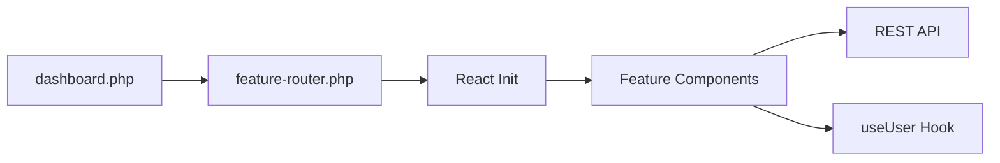

Below is a **final, detailed `README.md`** suited for **Cursor AI** integration. It provides a clear overview of your **Feature-First**, **WordPress-based** project design, references your new **`ARCHITECTURE.md`**, and outlines development workflows, data storage strategies, and testing procedures.

---

# Athlete Dashboard

A **React/TypeScript-powered** WordPress child theme designed to help athletes track and analyze workouts, goals, and progress. This project follows a **Feature-First** architecture, relying on **WordPress user meta** for storing user information (Profile, Training Persona, Equipment/Environment) and a **custom post type** for workouts.

---

## **Project Overview**

1. **Feature-First Architecture**  
   - Each feature is self-contained, including its own logic, UI components, styling, and documentation.  
   - Communication happens via an **event-driven** system, ensuring features remain decoupled.

2. **WordPress + React Integration**  
   - **WordPress PHP** provides the backend, using user meta for profile data and a custom post type (`workout`) for repeated entries.
   - **React/TypeScript** forms the interactive frontend (modals, dashboards).
   - Uses `@wordpress/scripts` for modern development workflow.

3. **Key Features**  
   - **Profile Management**: Collect user details (e.g., Age, Gender, Height, Weight, Injuries).  
   - **Training Persona**: Store preferences (experience level, workout frequency) in user meta.  
   - **Equipment/Environment**: Let users specify gym equipment or environment constraints.  
   - **AI Workout Generator**: Merge user data to generate or iterate workouts, storing them as `workout` posts.  
   - **Centralized User Data**: Management via `useUser` hook.
   - **Feature-based Routing**: Dynamic feature loading and routing system.
   - **Debug Mode**: Detailed system information for development.
   - **Manifest-based Asset Management**: Efficient asset handling and versioning.

---

## **Architecture**

This project uses a **Feature-First** architecture described in detail in **[`ARCHITECTURE.md`](./ARCHITECTURE.md)**. Key points include:

- **Encapsulation**: Each feature manages its own assets and logic.  
- **Minimal Shared Files**: Only essential shared resources (like an event bus) live outside feature folders.  
- **Event-Driven**: Features emit and listen for typed events to coordinate actions.
- **WordPress Data Model**: 
  - **User meta** for storing Profile, Persona, Equipment/Environment.  
  - **Custom Post Type** (`workout`) for logging and organizing workouts.

---

## **Data Flow**

1. WordPress Template (`dashboard.php`) → Feature Router
2. Feature Router → React Initialization
3. React Components → REST API
4. User Data Management through `useUser` hook



---

## **WordPress Integration Details**

- Custom REST API endpoint (`/custom/v1/profile`) for user data
- Feature routing through `feature-router.php`
- Script/style enqueuing through manifest-based system
- WordPress nonce integration for REST API security

---

## **Debugging**

Debug information is available when `WP_DEBUG` is enabled:

- Dashboard template displays debug panel with:
  - Template information
  - Current feature data
  - Script paths and existence
  - REST API configuration
- Console logging for React component lifecycle
- Network request monitoring for API calls

---

## **Common Issues**

1. **Script Loading Issues**
   - Check manifest.json exists in build directory
   - Verify build directory permissions
   - Confirm script enqueuing in functions.php

2. **REST API 404s**
   - Verify endpoint registration
   - Check user permissions
   - Confirm nonce configuration

3. **Feature Not Found**
   - Verify feature registration
   - Check routing configuration
   - Confirm feature name matches registration

---

## **Directory Structure**

A typical layout (simplified):

```plaintext
athlete-dashboard-child/
├── dashboard/                  # Core dashboard framework
│   ├── core/                   # Core PHP classes
│   ├── components/             # Shared React components
│   └── templates/              # Dashboard PHP templates
├── features/                   # Modular features
│   ├── profile/                # Profile feature (user meta)
│   ├── training-persona/       # Training persona feature (user meta)
│   ├── environment/            # Equipment/Environment feature (user meta)
│   └── ai-workout-generator/   # AI generator feature (writes to workout CPT)
├── assets/                     # Static assets
│   ├── build/                  # Production-ready assets
│   └── src/                    # Source files
└── tests/                      # Unit and integration tests
```

Each **feature** has its own:

- **`components/`** (React + TSX files)  
- **`assets/`** (SCSS, JS/TS services)  
- **`events.ts`** (feature-specific events)  
- **Feature interface implementation** (register/init for the dashboard)  
- **`README.md`** (feature-level documentation)

---

## **Key Features**

1. **Profile** (`features/profile/`)  
   - Stores user info (Name, Age, Gender, Injuries) in WordPress user meta.  
   - Emits `profile:updated` event on data changes.

2. **Training Persona** (`features/training-persona/`)  
   - Captures training level, desired workout duration, frequency.  
   - Also saved in user meta.  
   - Emits `training-persona:updated` on changes.

3. **Equipment/Environment** (`features/environment/`)  
   - Lists available equipment or environment constraints.  
   - Stored in user meta as `_user_equipment` or similar.  
   - Emits `environment:updated` after updates.

4. **AI Workout Generator** (`features/ai-workout-generator/`)  
   - Combines data from Profile, Persona, and Equipment to create or iterate workouts.  
   - Stores generated workouts as a **custom post type** (`workout`), using WordPress post meta for sets, reps, etc.  
   - Emits `ai-workout:generated` on successful creation.

---

## **Installation & Setup**

1. **Clone the Repository**  
   ```bash
   git clone <repo-url> athlete-dashboard-child
   cd athlete-dashboard-child
   ```

2. **Install Dependencies**  
   ```bash
   npm install
   ```

3. **Development Build**  
   ```bash
   npm run start
   ```
   - Runs WordPress scripts development server with hot reload

4. **Production Build**  
   ```bash
   npm run build
   ```
   - Creates optimized production build in `assets/build`

5. **Activate the Child Theme**  
   - Copy the theme folder to `wp-content/themes/`
   - Activate via WordPress Admin (`Appearance > Themes`)

---

## **Development Workflow**

1. **Start Development Server**
   ```bash
   npm run start
   ```
   - Enables hot reloading for React components
   - Compiles TypeScript in watch mode
   - Processes SCSS files

2. **Build for Production**
   ```bash
   npm run build
   ```
   - Creates minified, production-ready assets
   - Generates asset manifest for WordPress

3. **Run Tests**
   ```bash
   npm run test
   ```
   - Runs all test suites
   - See `docs/TESTING.md` for detailed testing guide
   - Feature-specific test documentation available in `features/*/tests/README.md`

---

## **Contributing**

1. **Fork & Branch**  
   ```bash
   git checkout -b feature/<your-feature>
   ```
2. **Add Your Feature**  
   - Follow Feature-First guidelines
   - Write tests
   - Update documentation
3. **Pull Request**  
   - Ensure tests pass
   - Follow coding standards

---

## **License**

GNU General Public License v2 (or later). See [LICENSE](LICENSE) for details.

---

## **Additional References**

- **[`ARCHITECTURE.md`](./ARCHITECTURE.md)**: Detailed technical breakdown of the Feature-First and event-driven approach.  
- **[WordPress Developer Docs](https://developer.wordpress.org/)**: For custom post types, user meta, and theme development best practices.  
- **React & TypeScript**: For frontend building, strongly typed components, and event-driven UI logic.

---

**This `README.md`** provides the starting point for **Cursor AI** to scaffold and automate coding tasks. If you have further questions or need to expand features, consult the **feature-specific READMEs** or reach out to the development team. 

Enjoy building your **Athlete Dashboard**!